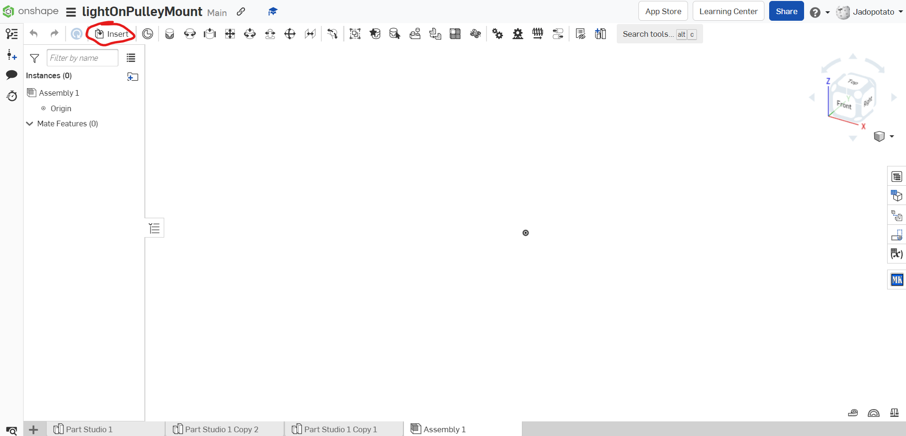

Stuff to be done on this page:  
 - [ ] Write out the Inserting Parts guide
 - [ ] Add pictures to the Inserting Parts guide
 - [ ] Write out fasten and revolute mates
 - [ ] Add pictures to the mate section

## Inserting Parts and Assemblies
  To access the same parts we have in the ftc closet, we have the FTC Parts List. This section will explain how to insert parts from that folder or from any of your other documents.  

  To insert a part, first click the "Insert" button at the top left of the screen. Alternately, you can press the "s" key and click the top left image on the panel that pops up.

  The "Inserting Parts and Assemblies" window starts on the "Current Document" tab by default, so if you are only trying to import a part or assembly from the document you are currently on, you can skip to [Inserting the Part](#inserting-the-part). Otherwise, if you are trying to insert a part or assembly from the FTC Parts List, go to the "Other Documents" tab.
> Needs Image of starting "Inserting Parts and Assemblies" window

 From the Other Documents tab, navigate to "FTC Robotics Parts Users", which has most of the ftc parts supplied by major FTC part vendors such as goBILDA and REV Robotics.
> Shall require an image of le "Other Documents" tab wit da ftc rpu highlighted

This is the path I took to the part:  
| Insert | Other Documents | FTC Robotics Parts Users | goBILDA | MOTION | Motors | 5203 Series Yellow Jacket Planetary Gear Motors(configurable) -- v4 |
| ------ | --------------- | ------------------------ | ------- | ------ | ------ | --- |
|  Image |      Image2     |          Image3          | Image4  | Image5 | Image6 | Image7 |

### Inserting the Part
  Once you have found the part you want to insert, click on it and move your cursor onto your assembly. A yellow preview of the item will follow your cursor around, and you left click to insert it.
> me need 3 images: example part (henceforth: motor) being highlighted, motor preview in viewport (w/ "Inserting Parts and Assemblies" window in view), y finalmente el motor actual con la ventana de insertar piezas y ensamblajes

  When you have inserted the part, hit the check mark to confirm the insertion. Clicking the X or hitting the Esc key will result in the insertion being canceled, though a popup will give you 30 seconds to restore the insertion.
> Probably image here

 
 Click for a surprise! :D  

._. <-- funny looking cat   
-|-   
/ \   

## Mates/Constraints
Mates are geometric constraints that define an object's position and the ways it can move in relation to faces, edges, or vertices.

### Fasten Mate
Fasten Mates are the simplest mates, rigidly connecting 2 faces like glue. To use a fasten mate, click on 

### Revolute Mate
Mate but spinny.
